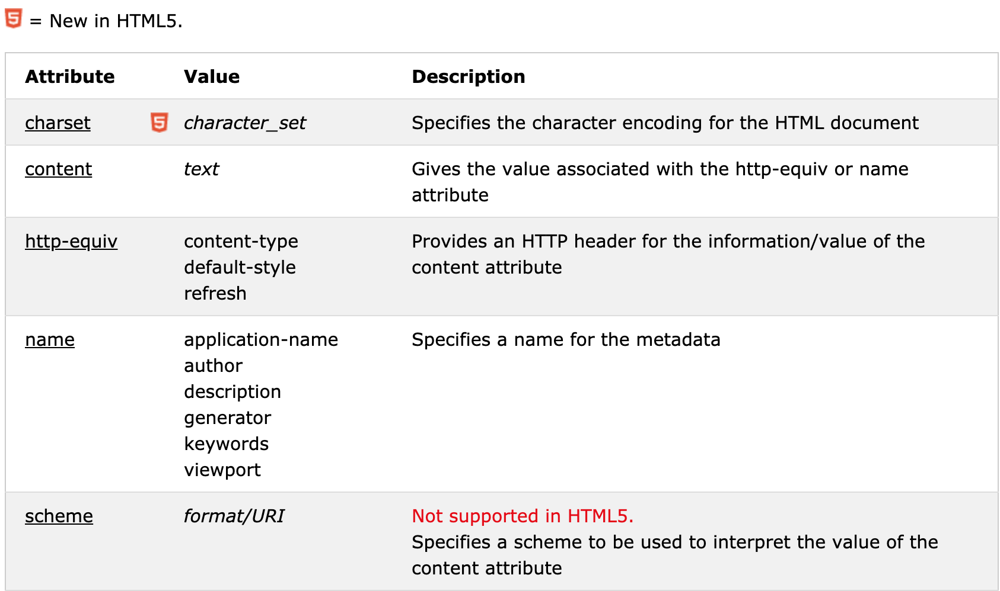

## Definition and Usage

Metadata is data (information) about data.

The `<meta>` tag provides metadata about the HTML document. Metadata will not be displayed on the page, but will be machine parsable.

Meta elements are typically used to specify page description, keywords, author of the document, last modified, and other metadata.

The metadata can be used by browsers (how to display content or reload page), search engines (keywords), or other web services.

HTML5 introduced a method to let web designers take control over the viewport (the user's visible area of a web page), through the `<meta>` tag (See "Setting The Viewport" example below).

## Tips and Notes

**Note**: `<meta>` tags always go inside the `<head>` element.

**Note**: Metadata is always passed as name/value pairs.

**Note**: The content attribute MUST be defined if the name or the http-equiv attribute is defined. If none of these are defined, the content attribute CANNOT be defined.

## Differences Between HTML 4.01 and HTML5

The scheme attribute is not supported in HTML5.

HTML5 has a new attribute, charset, which makes it easier to define charset:

- HTML 4.01: `<meta http-equiv="content-type" content="text/html; charset=UTF-8">`
- HTML5: `<meta charset="UTF-8">`

## Examples

Example 1 - Define keywords for search engines:

``` html
<meta name="keywords" content="HTML, CSS, XML, XHTML, JavaScript">
```

Example 2 - Define a description of your web page:

``` html
<meta name="description" content="Free Web tutorials on HTML and CSS">
```

Example 3 - Define the author of a page:

``` html
<meta name="author" content="John Doe">
```

Example 4 - Refresh document every 30 seconds:

``` html
<meta http-equiv="refresh" content="30">
```

Example 5 - Setting the viewport to make your website look good on all devices:

``` html
<meta name="viewport" content="width=device-width, initial-scale=1.0">
```

## Attributes

